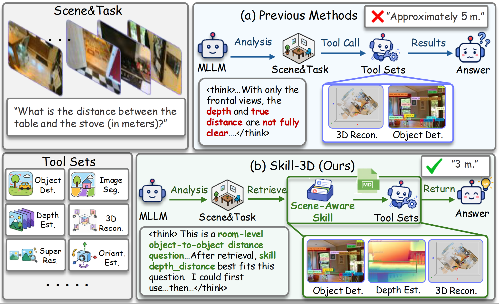
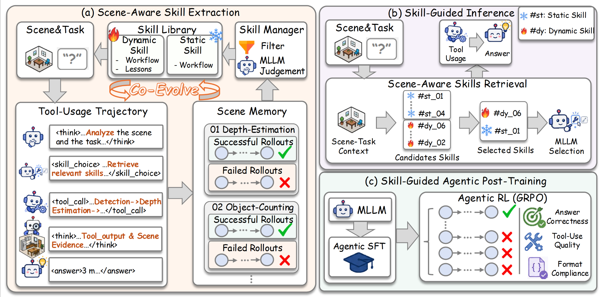

# Skill-3D: Evolving Scene-Aware Skills for Agentic 3D Spatial Reasoning<!-- omit in toc -->

<p align="center">
  <a href="https://arxiv.org/abs/2606.07436"></a>
  <a href="https://huggingface.co/datasets/lhy-zju/Skill-3D"></a>
  <a href="https://skill-3d.github.io/"></a>
  <a href="LICENSE"></a>
  
</p>

---

## 📚 Contents<!-- omit in toc -->


- [✨ Key Features](#-key-features)
- [📦 Dataset](#-dataset)
- [⚙️ Environment Setup](#️-environment-setup)
- [🛠️ Tool Services](#️-tool-services)
- [🔍 Inference](#-inference)
- [🏋️ Training](#️-training)
- [📁 Repository Structure](#-repository-structure)
- [📝 Citation](#-citation)
- [🙏 Acknowledgement](#-acknowledgement)
- [📄 License](#-license)

---

## ✨ Key Features

**Skill-3D** is a framework for **agentic 3D spatial reasoning**, where multimodal LLM agents solve spatial reasoning tasks through external perception and geometry tools. Existing tool-augmented agents often apply uniform tool-use strategies across heterogeneous 3D scenes, leading to mismatched evidence, redundant tool calls, and limited gains over non-agentic baselines.

Skill-3D addresses this by constructing a **Scene Memory** and evolving a **Skill Library**. Successful tool-use rollouts are distilled into reusable scene-aware workflows, while failed rollouts are retained as corrective lessons. At inference time, Skill-3D retrieves scene-task-relevant skills to guide tool planning, evidence acquisition, and answer grounding. We further use skill-guided trajectories for agentic SFT and GRPO, transferring scene-aware tool-use behavior into compact MLLM agents.

<p align="center">
  
</p>

### Method:

- **Scene-aware skill extraction.** Successful rollouts become reusable workflows; failures become lessons.

- **Scene Memory and Skill Library.** Unless otherwise specified, training splits from all benchmarks are pooled to construct one shared memory and skill library; test samples are never used for skill construction or post-training.
- **Improved tool utilization.** Skill-3D improves effective tool usage from **39% to 78%** on VSI-Bench.

<p align="center">
  
</p>

---

## 📦 Dataset

We evaluate Skill-3D on four 3D spatial reasoning benchmarks:

- **[VSI-Bench](https://huggingface.co/datasets/nyu-visionx/VSI-Bench)**: object counting, metric distance, object size, room size, relative direction, route planning, and appearance order.
- **[BLINK](https://huggingface.co/datasets/BLINK-Benchmark/BLINK)**: multi-view spatial reasoning.
- **[CV-3D / CV-Bench](https://huggingface.co/datasets/nyu-visionx/CV-Bench)**: depth ordering and relative distance reasoning.
- **[MMSI-Bench](https://huggingface.co/datasets/RunsenXu/MMSI-Bench)**: positional relationship reasoning.

A typical local data layout is:

```text
dataset/
|-- skill3d_splits/
|   |-- vsi_train.jsonl
|   |-- vsi_test.jsonl
|   |-- mmsi_pr_train.jsonl
|   |-- mmsi_pr_test.jsonl
|   |-- cv3d_train.jsonl
|   |-- cv3d_test.jsonl
|   |-- blink_multiview_train.jsonl
|   `-- blink_multiview_test.jsonl
|-- VSI-Bench/   
|-- MMSI-Bench/  
|-- CV-3D/       
`-- BLINK/       
```

We release the `skill3d_splits` used for skill evolution, post-training, and
evaluation [here](https://huggingface.co/datasets/lhy-zju/Skill-3D).
Teacher-generated rollouts are collected only from training samples; held-out
test samples are not used for skill construction or post-training.

---

## ⚙️ Environment Setup

We test under the following environment:

- Python 3.11
- PyTorch with CUDA 12.8
- OpenAI-compatible API client
- vLLM for local inference

Clone the repository:

```bash
git clone https://github.com/skill-3d/Skill-3D.git
cd Skill-3D
```

Install dependencies:

```bash
conda create -n skill3d python=3.11
conda activate skill3d

pip install -r requirements.txt
pip install "httpx[socks]"
```

External expert tools require their own checkpoints and dependencies. Install and launch only the tool services needed for your experiments.

---

## 🛠️ Tool Services

All tool-augmented methods should use the same tool pool unless otherwise specified.

| Tool | Environment Variable | Default URL |
| --- | --- | --- |
| [Depth-Anything-3](https://github.com/bytedance-seed/depth-anything-3) | `DEPTH_SERVER_URL` | `http://127.0.0.1:20019` |
| [SAM3](https://github.com/facebookresearch/sam3) | `SEGMENTATION_SERVER_URL` | `http://127.0.0.1:20020` |
| [GroundingDINO](https://github.com/IDEA-Research/GroundingDINO) | `DETECTION_SERVER_URL` | `http://127.0.0.1:20022` |
| [Pi3](https://github.com/yyfz/Pi3) | `PI3_SERVER_URL` | `http://127.0.0.1:20030` |
| [SwinIR](https://github.com/JingyunLiang/SwinIR) | `SWINIR_SERVER_URL` | `http://127.0.0.1:20032` |
| [Orient-Anything v2](https://github.com/SpatialVision/Orient-Anything-V2) | `ORIENT_ANYTHING_SERVER_URL` | `http://127.0.0.1:20034` |

Start the needed services before running Skill-3D inference. The commands below
use the default ports expected by `scripts/common_env.sh`; choose different
`CUDA_VISIBLE_DEVICES` values if you distribute tools across GPUs.

```bash
# Metric depth
python skill3d/external_experts/Depth_AnythingV3/depth_server.py \
  --model_dir checkpoints/depth_anything/DA3METRIC-LARGE \
  --port 20019

# Segmentation
python skill3d/external_experts/SAM3/sam3_server.py \
  --checkpoint_path checkpoints/sam3.1/sam3.1_multiplex.pt \
  --sam3_repo third_party/sam3 \
  --port 20020

# Open-vocabulary detection
python skill3d/external_experts/GroundingDINO/grounding_dino_server.py \
  --checkpoint_path checkpoints/grounding_dino/groundingdino_swinb_cogcoor.pth \
  --port 20022

# 3D reconstruction
python skill3d/external_experts/Pi3/pi3_server.py \
  --checkpoint_path checkpoints/pi3/model.safetensors \
  --port 20030

# Super-resolution / restoration
python skill3d/external_experts/SwinIR/swinir_server.py \
  --repo_dir third_party/SwinIR \
  --weights_dir checkpoints/swinir \
  --port 20032

# Object orientation
python skill3d/external_experts/OrientAnything/orient_anything_server.py \
  --repo_dir third_party/Orient-Anything \
  --ckpt_path checkpoints/orient_anything/dino_weight.pt \
  --port 20034
```

Approximate peak GPU memory for single-request inference is listed below. These
numbers are planning estimates and vary with image resolution, frame count,
precision, tiling, and CUDA allocator state.

| Service | Typical Input | Approx. Peak VRAM |
| --- | --- | --- |
| Depth Anything metric depth | one resized image, `process_res=504` | 10-14 GB |
| SAM3 segmentation | one image with text/box prompt | 14-20 GB |
| GroundingDINO detection | one 640-1024px image | 3-5 GB |
| Pi3 reconstruction | multiple frames | 18-28 GB |
| SwinIR restoration | one image, tiled inference recommended | 2-6 GB |
| Orient-Anything v2 | one object crop or image | 3-6 GB |

A typical checkpoint layout follows the local expert-service convention:

```text
checkpoints/
|-- depth_anything/
|   |-- DA3METRIC-LARGE/
|   |   |-- config.json
|   |   `-- model.safetensors
|   `-- depth_anything_v2_vitb.pth
|-- grounding_dino/
|   `-- groundingdino_swinb_cogcoor.pth
|-- orient_anything/
|   `-- dino_weight.pt
|-- pi3/
|   `-- model.safetensors
|-- sam3.1/
|   |-- config.json
|   |-- processor_config.json
|   |-- sam3.1_multiplex.pt
|   |-- tokenizer.json
|   |-- tokenizer_config.json
|   |-- vocab.json
|   `-- merges.txt
`-- swinir/
    `-- 003_realSR_BSRGAN_DFOWMFC_s64w8_SwinIR-L_x4_PSNR-with-dict-keys-params-and-params_ema.pth
```


---

## 🔍 Inference

API inference with an OpenAI-compatible model:

```bash
export OPENAI_API_KEY=<your_key>
export OPENAI_BASE_URL=<your_base_url>

BENCHMARK=vsi \
USE_MODEL=gpt-5.4 \
bash scripts/run_skill3d_gpt54_inference.sh
```

Common overrides:

```bash
DATA_PATH=dataset/skill3d_splits/vsi_test.jsonl
IMAGE_BASE_PATH=dataset
MAX_WORKERS=4
RETRIEVAL_TOP_K=6
```

Start a local vLLM server:

```bash
MODEL_PATH=/path/to/Skill-3D-checkpoint \
SERVED_MODEL_NAME=Skill-3D-GRPO-4B \
GPU_DEVICE=0 \
PORT=8001 \
bash scripts/vllm_start.sh
```

Run inference with the local endpoint:

```bash
BENCHMARK=vsi \
USE_MODEL=Skill-3D-GRPO-4B \
LLM_BASE_URL=http://localhost:8001/v1 \
bash scripts/run_skill3d_qwen_sft_inference.sh
```

Outputs are stored under `results/`, while logs are written under `logs/`.

---

## 🏋️ Training

The repository includes SFT/GRPO shell templates and prompt files for reproducibility. Training requires local artifacts that are not tracked.
We also release the SFT- and GRPO-trained 4B/8B checkpoints 
[here](https://huggingface.co/datasets/lhy-zju/Skill-3D).

- [Qwen3-VL-4B-Instruct](https://huggingface.co/Qwen/Qwen3-VL-4B-Instruct/tree/main) and [Qwen3-VL-8B-Instruct](https://huggingface.co/Qwen/Qwen3-VL-8B-Instruct/tree/main) checkpoints
- [SFT](https://huggingface.co/datasets/lhy-zju/Skill-3D) and [GRPO](https://huggingface.co/datasets/lhy-zju/Skill-3D) files 
- generated Scene Memory and Skill Library
- running tool services
- optional training plugins

Agentic SFT:

```bash
MODEL_PATH=/path/to/Qwen3-VL \
DATASET_JSONL=/path/to/sft_messages.jsonl \
bash train/train_sft.sh
```

GRPO:

```bash
MODEL_PATH=/path/to/sft-checkpoint \
DATASET_PATH=/path/to/Skill-3D-GRPO-mixed1000.jsonl \
bash train/train_grpo.sh
```


---

## 📁 Repository Structure

```text
Skill-3D/
|-- skill3d/                  # Core package
|   |-- core/                 # Agent, memory, skills, tool registry
|   |-- models/               # GPT, Qwen, and local vLLM wrappers
|   |-- tools/                # Tool wrappers
|   |-- external_experts/     # Client/server implementations
|   `-- vllm_models/          # OpenAI-compatible backend helpers
|-- statics/skill3d_shared/   # Public skeleton for generated memory
|-- examples/evaluation/      # Minimal evaluation entry used by inference
|-- scripts/                  # API inference, Qwen inference, vLLM startup
|-- train/                    # Post-training prompt/shell templates
|-- third_party/              # Lightweight third-party source trees
`-- test/                     # Unit and integration checks
```

By default, Skill-3D uses a shared memory root:

```bash
export MEMORY_ROOT=statics/skill3d_shared
export SKILL3D_SKILL_STORAGE_PATH=${MEMORY_ROOT}/learned_skills.json
export SKILL3D_HIERARCHICAL_MEMORY_DIR=${MEMORY_ROOT}/memory
export RETRIEVAL_TOP_K=6
```

For held-out evaluation and post-training, the Skill Library should remain frozen. The provided inference scripts use `--disable_skill_update` by default.

---

## 📝 Citation

If you find this repository useful, please cite:

```bibtex
@article{li2026skill3d,
  title   = {Skill-3D: Evolving Scene-Aware Skills for Agentic 3D Spatial Reasoning},
  author  = {Li, Haoyuan and Hu, Zhengdong and Wang, Jun and Fan, Hehe and Yang, Yi},
  journal = {arXiv preprint arXiv:2606.07436},
  year    = {2026}
}
```

---

## 🙏 Acknowledgement

Skill-3D builds on the [Think3D/SPAgent](https://github.com/zhangzaibin/spagent) codebase and integrates open-source expert tools including [GroundingDINO](https://github.com/IDEA-Research/GroundingDINO), [SAM3](https://github.com/facebookresearch/sam3), [Depth-Anything-3](https://github.com/bytedance-seed/depth-anything-3), [Pi3](https://github.com/yyfz/Pi3), [SwinIR](https://github.com/JingyunLiang/SwinIR), [Orient-Anything](https://github.com/SpatialVision/Orient-Anything-V2), [ms-swift](https://github.com/modelscope/ms-swift), and [vLLM](https://github.com/vllm-project/vllm).

---

## 📄 License

This project is released under the Apache-2.0 License. See [LICENSE](LICENSE).
